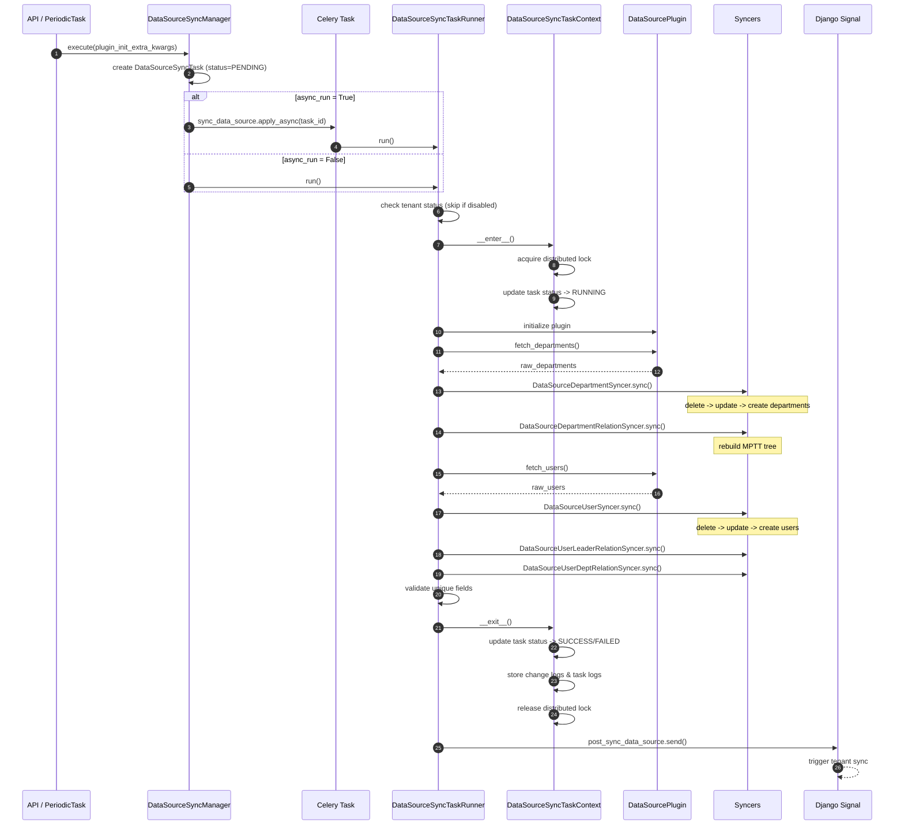
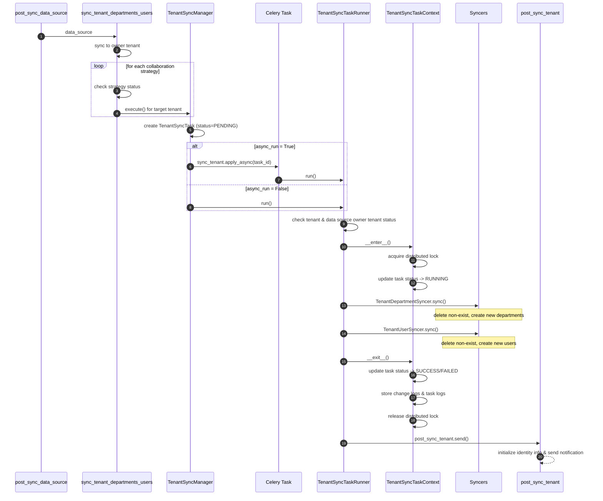
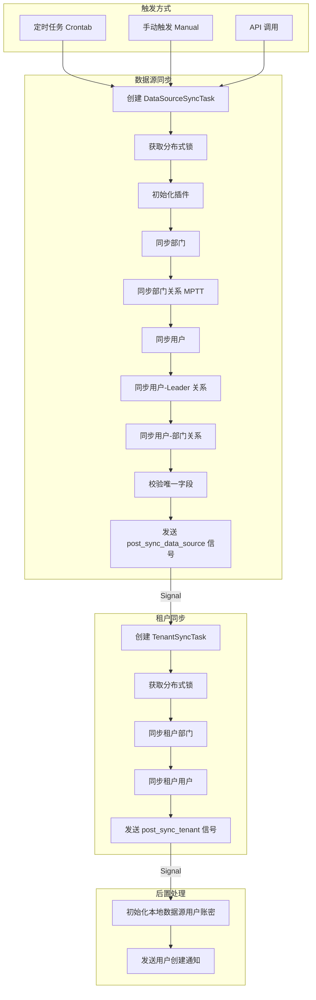

# 数据源同步 & 租户同步流程说明

本模块负责数据源同步和租户同步，是用户管理系统的核心模块之一。

## 核心概念

### 两阶段同步

系统采用两阶段同步架构：

1. **数据源同步 (DataSourceSync)**：从外部数据源（如 LDAP、本地 Excel 导入等）拉取原始数据，同步到 `DataSourceUser` / `DataSourceDepartment` 等表
2. **租户同步 (TenantSync)**：将数据源表中的数据同步到 `TenantUser` / `TenantDepartment` 表，供业务使用

### 触发方式

| 触发方式      | 说明                                     |
|-----------|----------------------------------------|
| `crontab` | 定时任务触发，由 `periodic_tasks.py` 中的任务周期性执行 |
| `manual`  | 用户通过 API 手动触发同步                        |
| `signal`  | 信号触发，数据源同步完成后自动触发租户同步                  |

### 同步模式

| 参数            | 说明                                         |
|---------------|--------------------------------------------|
| `incremental` | 增量模式：仅处理本次提供的数据，不删除数据源中已有但本次未提供的数据         |
| `overwrite`   | 覆盖模式：对已存在的同名用户/部门进行字段覆盖更新；若为 `False` 则跳过更新 |

> 注意：全量模式（`incremental=False`）下强制 `overwrite=True`

### 同步对象类型

**数据源同步对象**：
- `DEPARTMENT`：部门主体
- `DEPARTMENT_RELATION`：部门间父子关系（MPTT 树结构）
- `USER`：用户主体
- `USER_LEADER_RELATION`：用户与直接上级的关系
- `USER_DEPARTMENT_RELATION`：用户与部门的归属关系

**租户同步对象**：
- `USER`：租户用户
- `DEPARTMENT`：租户部门

## 模块结构

```
sync/
├── constants.py          # 常量定义（同步周期、任务状态、操作类型等）
├── contexts/             # 同步任务上下文管理器
│   ├── data_source.py    # DataSourceSyncTaskContext
│   └── tenant.py         # TenantSyncTaskContext
├── converters.py         # 数据转换器
├── data_models.py        # Pydantic 数据模型（同步选项、同步配置）
├── exceptions.py         # 自定义异常
├── handlers.py           # Django 信号处理器
├── locks.py              # 分布式锁（基于 Redis）
├── loggers.py            # 任务日志记录器
├── managers.py           # 同步管理器（Manager）
├── models.py             # Django ORM 模型（任务、变更日志）
├── names.py              # 命名工具函数
├── periodic_tasks.py     # Celery Beat 定时任务
├── recorders.py          # 变更记录器
├── runners/              # 任务执行器（Runner）
│   ├── data_source.py    # DataSourceSyncTaskRunner
│   └── tenant.py         # TenantSyncTaskRunner
├── shortcuts.py          # 快捷函数
├── signals.py            # Django 信号定义
├── syncers/              # 同步器（Syncer）
│   ├── data_source_department.py   # 部门 & 部门关系同步
│   ├── data_source_user.py         # 用户 & 用户关系同步
│   ├── tenant_department.py        # 租户部门同步
│   └── tenant_user.py              # 租户用户同步
├── tasks.py              # Celery 异步任务
├── validators.py         # 数据校验器
└── workbook_temp_store.py # Excel 临时存储（本地数据源导入）
```

## 同步流程图

### 数据源同步流程



### 租户同步流程



### 完整同步链路



## 关键设计

### 分布式锁

使用 Redis 分布式锁避免同一数据源/租户的同步任务并发执行：
- `DataSourceSyncTaskLock`：按 `data_source_id` 加锁
- `TenantSyncTaskLock`：按 `tenant_id + data_source_id` 加锁

### 同步顺序

数据源同步的资源处理顺序为：**部门 → 部门关系 → 用户 → 用户-Leader 关系 → 用户-部门关系**

每种资源的变更操作顺序为：**删除 → 更新 → 创建**（先让数据库"干净"，避免唯一约束冲突）

### 部门关系 MPTT

部门间的父子关系使用 `django-mptt` 管理，同步时采用"全量删除后重建"策略，通过 `tree_id` 隔离不同的组织树。

### 变更日志

同步过程中的所有变更（创建/更新/删除）都会被记录到 `ChangeLog` 表，便于审计和问题排查。

### 协同同步

当存在已启用的协同策略（`CollaborationStrategy`）时，数据源同步完成后会自动将数据同步到协同租户。

## 数据模型

### 任务相关
- `DataSourceSyncTask`：数据源同步任务
- `TenantSyncTask`：租户同步任务

### 变更日志
- `DataSourceUserChangeLog`：数据源用户变更日志
- `DataSourceDepartmentChangeLog`：数据源部门变更日志
- `TenantUserChangeLog`：租户用户变更日志
- `TenantDepartmentChangeLog`：租户部门变更日志

## 同步选项

### DataSourceSyncOptions

| 字段            | 类型                | 默认值       | 说明         |
|---------------|-------------------|-----------|------------|
| `operator`    | `str`             | `""`      | 操作人        |
| `overwrite`   | `bool`            | `False`   | 是否覆盖已存在的数据 |
| `incremental` | `bool`            | `False`   | 是否增量同步     |
| `async_run`   | `bool`            | `True`    | 是否异步执行     |
| `trigger`     | `SyncTaskTrigger` | `CRONTAB` | 触发方式       |

### TenantSyncOptions

| 字段          | 类型                | 默认值      | 说明     |
|-------------|-------------------|----------|--------|
| `operator`  | `str`             | `""`     | 操作人    |
| `async_run` | `bool`            | `True`   | 是否异步执行 |
| `trigger`   | `SyncTaskTrigger` | `SIGNAL` | 触发方式   |

## 定时任务

| 任务                                                   | 说明                |
|------------------------------------------------------|-------------------|
| `build_and_run_data_source_sync_task`                | 定时同步指定数据源         |
| `mark_running_sync_task_as_failed_if_exceed_one_day` | 将运行超过 1 天的任务标记为失败 |

## 管理命令

```bash
# 释放同步锁（用于锁异常未释放的情况）
python manage.py release_sync_lock --data-source-id <id>
python manage.py release_sync_lock --tenant-id <id> --data-source-id <id>
```
